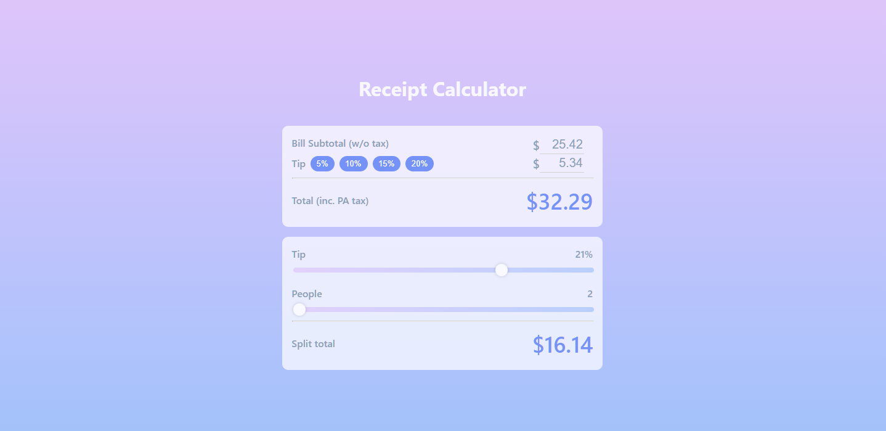

# Receipt Calculator 

[Purpose](#purpose) •
[Screenshots](#screenshots) •
[Tech Stack](#tech-stack) •
[Lessons Learned](#lessons-learned)

## Purpose

- A receipt calculator that takes in a bill subtotal and a percentage tip to calculate the total bill including the split based on the number of people.

## Screenshots

    

## Tech Stack

| Tech Name  | Home Page               |
| ---------- | ----------------------- |
| TypeScript      | <https://www.typescriptlang.org/>  |
| React      | <https://reactjs.org/>  |
| Vite       | <https://vitejs.dev/>   |

## Lessons Learned

This was a good reminder of TypeScript + React. It reminded me why TypeScript is so good. It definitely does take more of an effort to write the code, but it really saves you time in the long run. Though this is a very small project, so the benefit is a bit harder to see since the code base isn't that difficult to understand.

Overall, this was a small project I was just able to check off the list of many other projects I have to complete. It was very fun to work on and reminded me how difficult it is to design simple things.

 Credits to Marisa Breedt for the design. https://dribbble.com/MarisaBreedt

